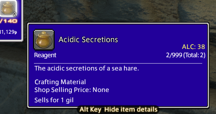

# FFXIV Material Level

A simple plugin that displays the max level crafting recipe that uses the material in the tooltip

Hover over an item and see what crafter class uses the item at the highest level. This recursively checks all recipes that use the mat as well as the recipes that use those recipes to find the highest level

No longer will you have to spiral down a Search for Recipes Using This Material rabbit hole to figure out if you need to keep some low level mat

## Installation

Pending approval via [Dalamud](https://github.com/goatcorp/FFXIVQuickLauncher)'s built-in plugin installer.
